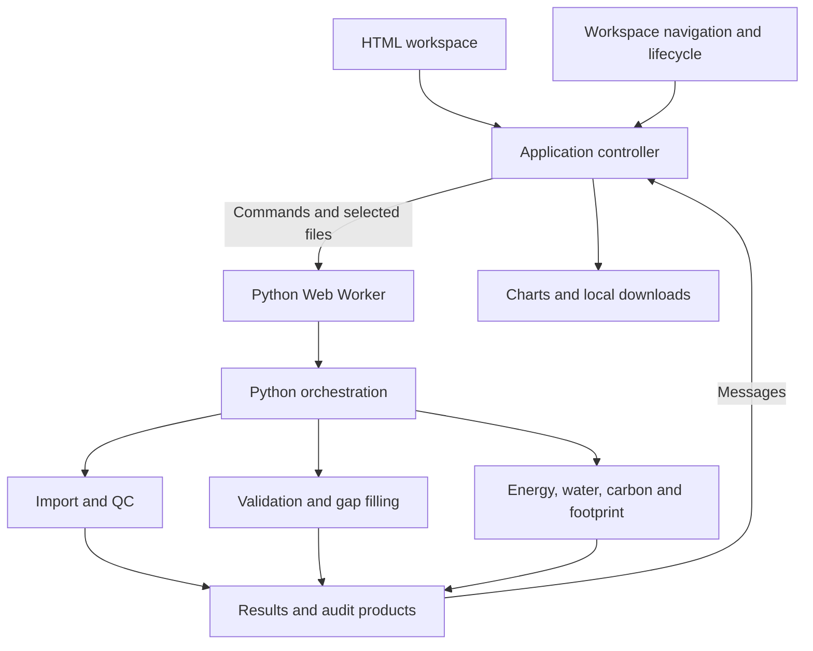

# FluxGapFill

A browser-based workspace for quality control, gap filling and analysis of **processed flux and environmental time series**.

Import a dataset, verify timestamps and units, screen observations, validate reconstruction methods, and export results with their provenance. Optional modules support energy-balance diagnostics, evapotranspiration, carbon partitioning and flux-footprint analysis.

**Suggestions and feedback:** [speddinti@ucdavis.edu](mailto:speddinti@ucdavis.edu)

## Start here

1. Open the application and choose a primary dataset under **Project & files**. To explore first, choose **Load example dataset**. The example is synthetic, not field measurements.
2. Set the project name, time zone, source time basis and accepted input QC flag. Add a supplemental weather file if needed.
3. Select **Inspect files**, then check timestamps, variable roles and units under **Variable mapping**. Select **Prepare dataset**.
4. Review **Data overview**, then configure and apply **Quality control**. Physical-range exclusions and optional spike screening are recorded in the QC audit.
5. Open **Validate & fill**. Choose target fluxes and candidate methods, run blocked validation, inspect performance and reconstruct the actual gaps.
6. Review **Results**. Measured and reconstructed records retain their source labels. Empirical uncertainty is available only when the validation supports it.
7. Use optional analyses if relevant, or go directly to **Data & figures**. Download your numerical products, diagnostics and figures before closing the tab.

The top workflow strip summarizes the core route. Sidebar checkmarks indicate completed processing steps, not scientific approval. Contextual help explains each page. Empty pages show the prerequisite and a direct action instead of unexplained blank charts.

## Scope and input data

FluxGapFill starts from already-computed fluxes, typically at half-hourly or hourly resolution. It does not compute eddy-covariance fluxes from raw high-frequency sonic-anemometer or gas-analyzer signals.

| Input | Purpose |
| --- | --- |
| EddyPro full-output TXT | Specialized processed-flux import |
| Campbell TOA5 DAT | Logger table detection, timestamp and variable mapping |
| AmeriFlux / FLUXNET-style CSV | Recognition of common timestamp and variable names |
| Generic CSV, TSV, TXT or DAT | Explicit mapping when names are unfamiliar |
| Excel and related spreadsheets | Table import through the runtime's spreadsheet reader; confirm the detected sheet and fields |
| Optional weather file, including CIMIS | Align environmental predictors with the primary time grid |
| Optional irrigation file | Add interval or daily applied-water observations |
| Optional GeoJSON polygons | Calculate footprint contribution for areas of interest |

Auto-detection is a proposal. Check units, timestamp convention, sign conventions and missing-value handling before analysis. Specialized EddyPro and CIMIS routes use their own parser conventions; generic mappings can be edited.

## Architecture

This is a static web application with scientific computation in a browser Web Worker. It requires no application server, account database or backend API for analysis.



### Interface and runtime components

| File | Responsibility |
| --- | --- |
| `public/index.html` | All workspace views, forms, tables, chart containers, help dialog and contact links |
| `public/assets/css/app.css` | Layout, typography, shared controls, responsive rules, light/dark/night themes and focus states |
| `public/assets/js/app.js` | Main application state, form payloads, worker commands, mapping tables, results rendering, help text, Plotly charts and figure exports |
| `public/assets/js/workspace.js` | Prerequisite empty states, navigation progress, example loading, runtime retry, keyboard access and invalidation of outdated results |
| `public/assets/js/py-worker.js` | Downloads the Python runtime and packages, loads local Python modules, copies selected files into temporary memory, dispatches commands and returns results/errors |
| `public/assets/vendor/plotly-6.5.2.min.js` | Bundled Plotly chart renderer; the filename is retained from the supplied package |
| `public/examples/` | Synthetic import examples and optional weather/irrigation datasets |
| `public/_headers` | Static-host response headers and cache policy |
| `public/deployment-check.html` | Build identifier for checking which package is being served |
| `public/favicon.svg`, `public/robots.txt` | Browser icon and crawler metadata |

`app.js` must load before `workspace.js`; both are deferred scripts. DOM IDs bind forms to the controller. Preserve those IDs when changing presentation. Worker message names are the interface between JavaScript and Python.

### Scientific Python components

| Component | What it does |
| --- | --- |
| `browser_engine.py` | Owns session datasets and analysis products; connects all modules; serializes chart summaries and exports |
| `universal_import.py` | Detects table formats, proposes variable mappings, converts units, creates a regular time grid, aligns supplemental data and checks module requirements |
| `data_processor.py` | Shared timestamp, interval, aggregation and alignment utilities; specialized EddyPro and reference-data readers |
| `scientific_qc.py` | Shared input quality screening, unit conversions and diagnostic utilities; not every helper is exposed as a separate UI control |
| `phase2_qc.py` | User-configured physical limits and optional robust rolling spike screening; produces rejection reasons and QC summaries |
| `gap_filler.py` | Gap-run identification and marginal distribution sampling (MDS), including donor and window diagnostics; also contains reusable RF/validation utilities |
| `advanced_ml_gap_filler.py` | Predictor construction, Random Forest and XGBoost training, prediction and model bundles |
| `validation_engine.py` | Contiguous artificial-gap validation; method comparisons by duration, day/night and season; empirical residual calibration |
| `calibration_utils.py` | Shared robust regression and error metrics |
| `external_sources.py` | Local CIMIS file selection, screening and alignment; the current interface does not automatically fetch a weather station online |
| `phase3_energy_water.py` | Soil heat-storage correction, energy closure, correction sensitivity scenarios, LE-to-ET conversion and water summaries |
| `phase4_carbon_footprint.py` | u* threshold diagnostics, nighttime respiration partitioning, footprint climatology and optional polygon contributions |

The historical `phase2`, `phase3` and `phase4` filenames are retained as internal module names. They are not separate applications or installation steps.

### Command and result flow

| User action | Worker command | Result event |
| --- | --- | --- |
| Inspect files | `inspect` | `inspected` |
| Prepare mapped dataset | `loadUniversal` | `loaded` |
| Apply quality control | `qc` | `qcDone` |
| Update site metadata | `updateProject` | `capabilities` |
| Validate methods | `benchmark` | `benchmarkDone` |
| Reconstruct gaps | `fill` | `fillDone` |
| Inspect / add irrigation | `inspectWater` / `loadWater` | `waterInspected` / `waterLoaded` |
| Energy and water analysis | `phase3` | `phase3Done` |
| Load GeoJSON | `loadAoi` | `aoiLoaded` |
| Carbon and footprint analysis | `phase4` | `phase4Done` |
| Download numerical results / reports | `export`, `exportBenchmark`, `exportQc`, `exportReport`, `exportPhase3`, `exportPhase3Report`, `exportPhase4`, `exportPhase4Report` | `exportReady` |

The worker also emits `ready`, `progress` and `error`. Python operations run away from the main UI thread. Initialization is nonblocking; processing actions become available when the runtime is ready. Analysis operations show progress so users do not edit inputs during a running calculation.

### Dataset lifecycle

- **Imported:** standardized source copy retained for repeatable QC.
- **Screened:** accepted observations and flagged exclusions.
- **Validated:** artificial-gap scores, duration-specific choices and available uncertainty calibration.
- **Reconstructed:** accepted measurements plus eligible filled gaps and method provenance.
- **Derived:** optional energy, water, carbon and footprint products.

Changing an input file invalidates downstream interface results. Preparing a new dataset or reapplying QC clears validation, reconstructed and derived products. Reconstructing again clears dependent domain products. Rerun the relevant modules after changing settings. Merely editing a configuration field does not recalculate results.

## Scientific terminology

| Term | Meaning |
| --- | --- |
| LE | Latent heat flux, usually W m⁻² |
| H | Sensible heat flux, usually W m⁻² |
| NEE | Net ecosystem CO₂ exchange, usually µmol m⁻² s⁻¹; verify the selected sign convention |
| Rn / G | Net radiation / ground heat flux, W m⁻² |
| ET / ETo | Evapotranspiration / reference evapotranspiration, commonly reported as mm per interval or day |
| VPD | Vapor-pressure deficit, kPa after normalization |
| SWC | Volumetric soil-water content, m³ m⁻³ after normalization |
| QC | Quality control; rejection rules and their recorded reasons |
| MDS | Marginal distribution sampling: reconstructs from measured donor observations under similar environmental conditions |
| RF / XGBoost | Random Forest / gradient-boosted decision trees |
| Blocked validation | Temporarily hides contiguous periods with known measurements, reconstructs them and scores predictions against the hidden observations |
| Adaptive filling | Selects eligible methods using validation evidence for the relevant gap duration |
| RMSE / MAE / bias | Root mean square error / mean absolute error / mean prediction error; reported in the target variable's units |
| R² | Coefficient of determination; it can be negative for poor predictions |
| Provenance | Per-record information identifying measured values, reconstruction methods and associated diagnostics |
| EBR | Energy-balance ratio: turbulent energy relative to available energy, with screening and aggregation defined by the module |
| u* | Friction velocity, m s⁻¹; an indicator of turbulent transfer |
| MPT / CPD | Moving-point-test-style plateau / change-point-detection-style threshold diagnostics |
| Reco / GPP | Ecosystem respiration / gross primary production; GPP is reported positive for uptake |
| PBL | Planetary boundary layer; height is an input to some correction and footprint calculations |
| FFP | Flux-footprint prediction parameterisation used to estimate source-area contributions |
| AOI | Area of interest represented by GeoJSON polygons |

## Analyses and interpretation

- Validate methods against gaps representative of your dataset. A short synthetic example is suitable for learning, not for establishing field performance.
- Validation evaluates retrospective reconstruction, not operational forecasting. Sparse observations and long gaps may prevent reliable reconstruction.
- Measured, QC-accepted values remain identifiable. Gaps outside the duration limit or without sufficient predictors may remain unfilled.
- Empirical reconstruction intervals depend on available blocked-validation residuals. They do not represent every source of measurement or model uncertainty.
- Energy-balance corrections are separate sensitivity products. They do not establish the physical cause of non-closure.
- Daily ET uses a completeness criterion. Review flagged partial days before interpreting totals.
- Carbon and footprint modules have additional assumptions and input requirements. Review module status and exported reports rather than interpreting a successful run as scientific validation.

See [METHODS_AND_REFERENCES.md](METHODS_AND_REFERENCES.md) and [SCIENCE_ENGINE_NOTES.md](SCIENCE_ENGINE_NOTES.md) for the inherited scientific-method descriptions.

## Exports

**Numerical products:** compact results, full provenance, standardized/QC data, rejection audit, validation details, summaries, temporal diagnostics and interval calibration. Optional module pages provide their own tables and Markdown reports.

**Figure Studio:** any rendered chart can be exported as PNG with 600-DPI metadata or editable SVG. Compact, wide and square presets specify physical dimensions. White export backgrounds are independent of the application theme; title, grid and legend settings are configurable. Inspect long labels and dense legends before distributing figures. Browser settings may request permission for multiple downloads.

## Privacy, persistence and dependencies

Selected scientific files are copied into a temporary Python filesystem inside the browser. This application does not upload those files to an analysis server. The static host and third-party runtime CDN still receive ordinary requests for application/runtime assets. Theme preference is stored in browser local storage.

Projects are **session-only**: there is no saved-project database or automatic restoration after reload. Download the results you need before refreshing or closing the page.

First use needs an internet connection to download Pyodide and its scientific packages. The worker requests NumPy, pandas, SciPy, scikit-learn, XGBoost, timezone data and spreadsheet support. The runtime mirror/version configuration is in `py-worker.js`; this redesign retains the supplied configuration. CDN availability, browser memory and CPU determine practical limits. A failed runtime connection shows a retry action without hiding the interface.

## Run locally

From this package directory, serve the `public` folder with Python:

```bash
python -m http.server 8000 --directory public
```

Open `http://localhost:8000`. Do not open `index.html` directly with `file://`; Web Workers and absolute asset paths require an HTTP server. There is no npm build step.

## Deploy the package

Use the existing static-host project and serve **`public`** as the site root. For the supplied Cloudflare Pages setup, retain framework `None`, build command `exit 0`, and output directory `public`. Put the package contents at the repository root rather than nesting another `fluxgapfill-main` directory inside it.

This task delivers source files; it does not publish a live deployment. After deploying, `/deployment-check.html` should display build **`20260924workspace`**. See [CLOUDFLARE_SETUP.txt](CLOUDFLARE_SETUP.txt).

## Maintenance and verification

Keep calculation logic in `public/py/`, rendering and messages in `app.js`, and workspace behavior in `workspace.js`. Change only the module responsible for the behavior. Update the build identifier in HTML asset queries, the worker URL, the worker `BUILD` constant and the deployment check when releasing changed assets.

[VERIFICATION.md](VERIFICATION.md) records checks performed for this package and their limits. Earlier development reports are under `docs/archive/` and are historical evidence, not a test report for this redesign.
